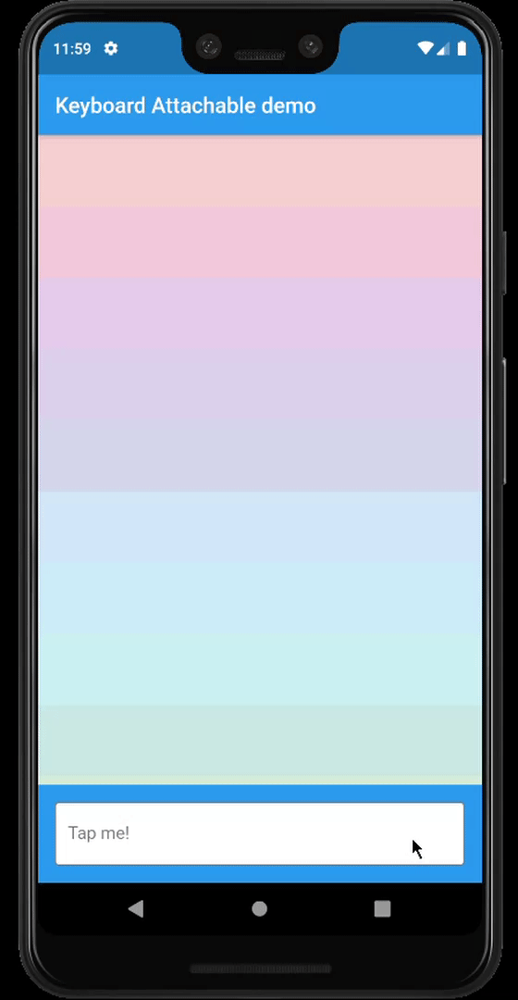

# keyboard_attachable

A Flutter package to build widgets that can be attached to the soft keyboard.

[](https://pub.dartlang.org/packages/keyboard_attachable)



## Features

* An alternative to Scaffold's `resizeToAvoidBottomInset`, with animations.
* Control the animations that should happen when the soft keyboard is shown and hidden with a transition builder.
* Animate the shrinkage and expansion of the page when the soft keyboard is shown and hidden, matching the platform soft keyboard animation.
* Easily add permanent page footers that can be attached to the top of the soft keyboard.

## Usage

This package exposes a `FooterLayout` stateless widget and a `KeyboardAttachable` stateful widget. 

`FooterLayout` is a widget that can lay out a child widget above a footer. It does that by 
positioning a footer widget at the bottom of the available space first, and then positioning a 
child widget in the remaining space.

```dart
    Widget build(BuildContext context) => FooterLayout(
          footer: MyFooterWidget(),
          child: PageMainContent(),
        );
```

`KeyboardAttachable` is a widget that adds space below its baseline when the soft keyboard is shown
and hidden with an animation that matches that of the platform keyboard. This widget can be used to 
animate its child when the soft keyboard is shown or hidden, so that the child widget appears to be 
attached to the keyboard.

You can combine these two widgets by passing a `KeyboardAttachable` widget as the footer of a
`FooterLayout` to create a page that shrinks and expands when the soft keyboard appears and 
disappears, with an animation that matches the platform keyboard animation. Additionally, you can 
pass a child widget to your `KeyboardAttachable` to have a footer in your page that attaches itself 
to the soft keyboard when shown.

> **Warning**: In order for this to work with animations, the `resizeToAvoidBottomInset` parameter
of the `Scaffold` above the page has to be `false`. In addition to that, when there are `SafeArea`s
involved the layout, it is recommended to set their `maintainBottomViewPadding` property to `true` in
order for the animations to run smoothly, like so:

```dart
/// Builds a [Scaffold] that lays out a footer at the bottom of the page.
class KeyboardAttachablePage extends StatelessWidget {
  @override
  Widget build(BuildContext context) => Scaffold(
        backgroundColor: Colors.blue,
        resizeToAvoidBottomInset: false,
        appBar: AppBar(title: const Text("Keyboard Attachable demo")),
        body: SafeArea(
          maintainBottomViewPadding: true,
          child: FooterLayout(
            footer: KeyboardAttachableFooter(),
            child: ColorsList(),
          ),
        ),
      );
}
```

## Getting started

In the `pubspec.yaml` of your flutter project, add the following dependency:

```yaml
dependencies:
  keyboard_attachable: "^[LATEST_VERSION]"
```

Then run `$ flutter pub get`. In your library, add the following import:

```dart
import 'package:keyboard_attachable/keyboard_attachable.dart';
```

## Author

Diego Rogel - [GitHub](https://github.com/drogel)

## Changelog

Check the [Changelog](./CHANGELOG.md) page to see what's recently changed.

## License

This project is licensed under the MIT License - see the [LICENSE](LICENSE) file for details.
